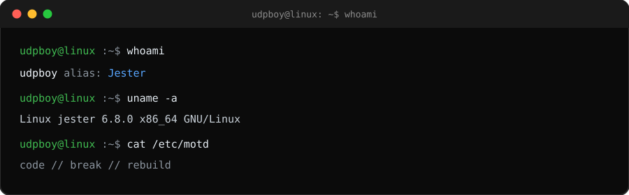
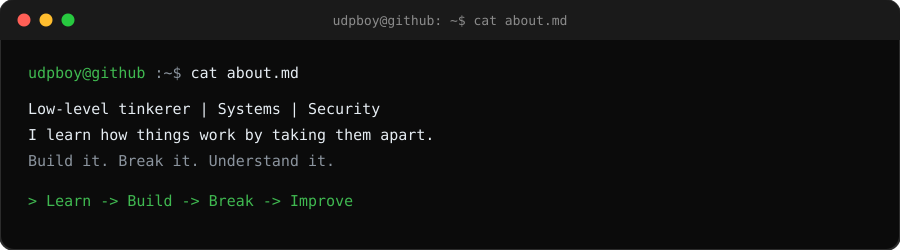
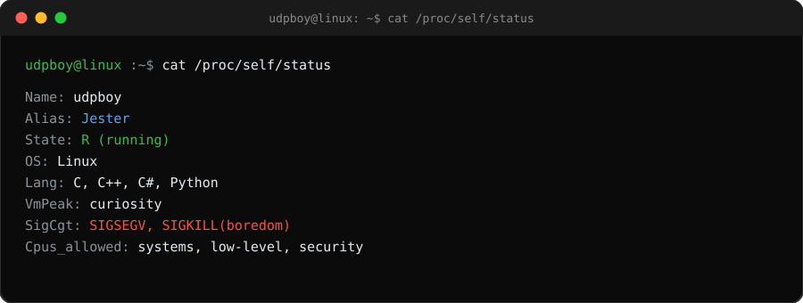
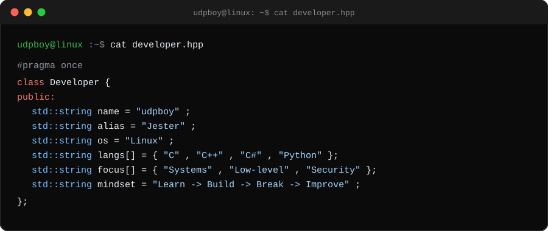
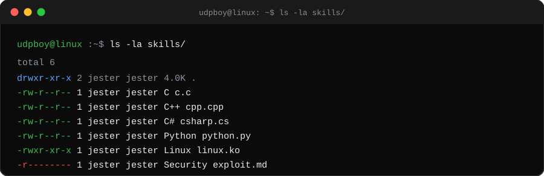
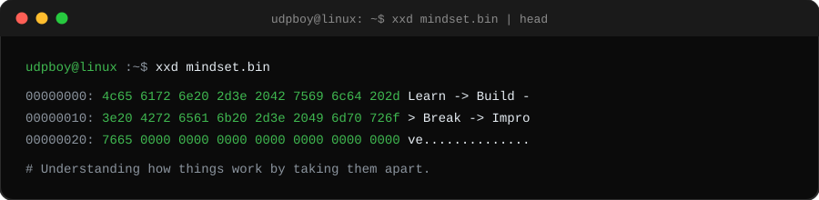

 

`udpboy-cell` · `udpboy` · `Jester`

 

---

  

## About Me

  

## /proc

  

## developer.hpp

  

## Skills

  

  

## xxd

  

## Stats

  
  

  

  

## Heatmap

  

  <picture>
    <source media="(prefers-color-scheme: dark)" srcset="https://raw.githubusercontent.com/udpboy-cell/udpboy-cell/output/github-contribution-grid-snake-dark.svg"/>
    <source media="(prefers-color-scheme: light)" srcset="https://raw.githubusercontent.com/udpboy-cell/udpboy-cell/output/github-contribution-grid-snake.svg"/>
    
  </picture>

---

